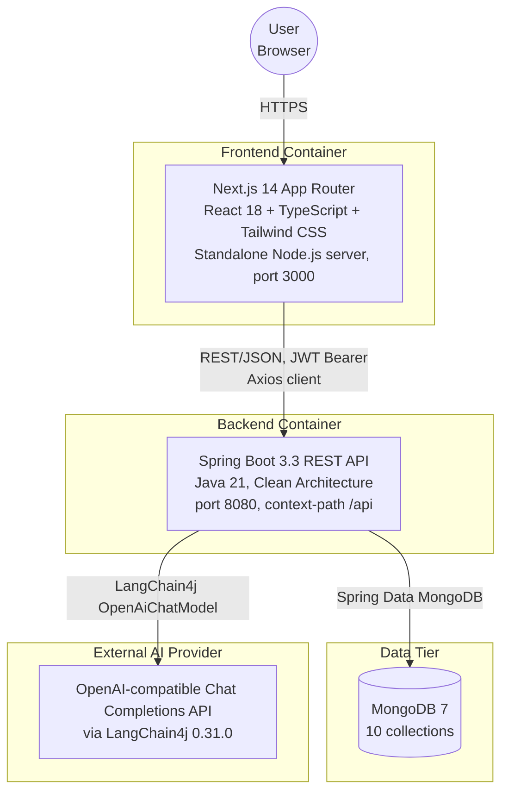
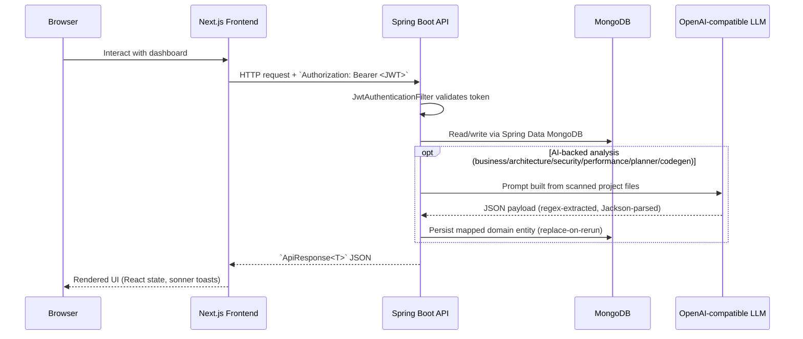
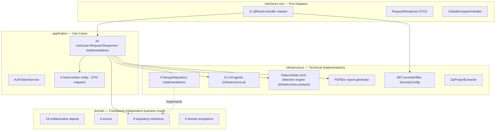
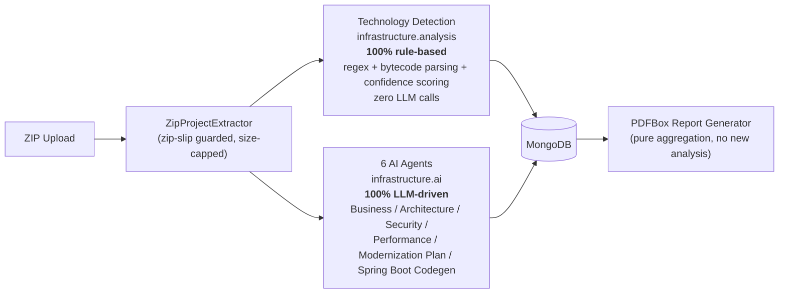

# System Architecture

> **Scope**: End-to-end architecture of the AI Legacy Modernization Copilot — a full-stack application that lets a user upload a legacy Java/JSP/COBOL codebase, runs a mix of deterministic and AI-driven analyses over it, and produces a modernization roadmap and downloadable report.
>
> Every fact in this document is drawn directly from the source code in this repository (`frontend/`, `backend/`) as of this writing. Where something is inferred rather than found in-repo (e.g. the production hosting platform), it is explicitly labeled as such.

---

## 1. Architecture Style

| Layer | Style | Why it matters |
|---|---|---|
| Frontend | Next.js 14 App Router, client-rendered dashboard behind a marketing landing page | Single deployable Node.js process; no separate BFF |
| Backend | Clean Architecture (domain → application → interfaces → infrastructure), REST over JSON | Framework-independent business rules, replaceable infrastructure |
| Persistence | MongoDB (document store), one collection per analysis type | Each analysis stage is stored as an independent, replaceable document keyed by `projectId` |
| AI | LangChain4j + OpenAI-compatible Chat Completions API | Six LLM-backed "agents" each producing structured JSON, consumed synchronously by a use case |
| Deployment | Docker containers (backend, frontend, MongoDB) via `docker-compose.yml` | Reproducible local/dev environment; each service also has its own standalone `Dockerfile` |

---

## 2. Container Diagram

---

## 3. Request Flow (Frontend → Backend → AI/DB)

---

## 4. Clean Architecture Layers (Backend)

The backend's own `backend/ARCHITECTURE.md` documents an intended four-layer Clean Architecture. This repository's actual code matches that intent for the layers that are truly used, but two of the documented packages (`application/orchestrators/`, `domain/services/`) are unused marker interfaces with no real implementation — see [06-backend-architecture.md](./06-backend-architecture.md) for the full, verified breakdown.

**Dependency rule in practice**: `domain` has zero dependencies on the other three layers (confirmed — no Spring/Mongo/Jackson imports in `domain/entities` or `domain/repositories`, only Lombok annotations). `application` depends only on `domain` types plus the `interfaces.rest.dto` response types it maps into (a minor layering deviation — see [06-backend-architecture.md](./06-backend-architecture.md)). `infrastructure` implements `domain` repository interfaces and is wired together purely via Spring dependency injection.

---

## 5. The Two Analysis Subsystems

A key architectural distinction in this system, confirmed by reading the actual analyzer code, is that **not everything is "AI"**:

See [09-ai-agent-design.md](./09-ai-agent-design.md) for full detail on both subsystems.

---

## 6. Cross-Cutting Concerns

| Concern | Implementation | Detail |
|---|---|---|
| AuthN | Stateless JWT (HS512), 15-min access token + 7-day rotating/revocable refresh token | [13-security-architecture.md](./13-security-architecture.md) |
| AuthZ | `Role` enum exists (`ADMIN`/`ARCHITECT`/`DEVELOPER`) but **is not enforced anywhere** — verified via a repo-wide search for `@PreAuthorize`/`hasRole` (zero matches) | [13-security-architecture.md](./13-security-architecture.md) |
| Error handling | `GlobalExceptionHandler` (`@RestControllerAdvice`) standardizes every error into the `ApiResponse` JSON envelope | [10-api-documentation.md](./10-api-documentation.md) |
| Validation | Jakarta Bean Validation (`@NotBlank`, `@Email`, `@Size`, `@NotNull`) on request DTOs | [10-api-documentation.md](./10-api-documentation.md) |
| Config | Four Spring profiles: `dev`, `docker`, `prod`, plus base `application.yml` | [12-deployment-architecture.md](./12-deployment-architecture.md) |
| Observability | Spring Boot Actuator (`health`, `info`, `metrics`, `prometheus` exposed) + SLF4J/Logback | [12-deployment-architecture.md](./12-deployment-architecture.md) |

---

## 7. What Is *Not* in This System

Documented explicitly because the code contains scaffolding for these that is never wired up — worth knowing so nobody assumes they're active:

- **No async job queue** — `infrastructure/queue/JobQueue.java` is an unimplemented interface. Every AI analysis runs synchronously inside the HTTP request/response cycle.
- **No pluggable object storage** — `infrastructure/storage/ObjectStorage.java` is an unimplemented interface (its Javadoc mentions S3/Azure Blob/GCS). Uploaded projects are extracted to local disk only, via `ZipProjectExtractor`.
- **No real domain-service or orchestrator layer** — `domain/services/BaseDomainService` and `application/orchestrators/Orchestrator` are empty marker interfaces with no implementations. Controllers call use cases directly.
- **No MapStruct-generated mapping**, despite the dependency being present — all 9 mappers are hand-written.
- **No CI/CD pipeline** — no `.github/workflows` directory exists in this repository.

---

*Related documents: [02-high-level-design.md](./02-high-level-design.md) · [06-backend-architecture.md](./06-backend-architecture.md) · [07-frontend-architecture.md](./07-frontend-architecture.md)*
