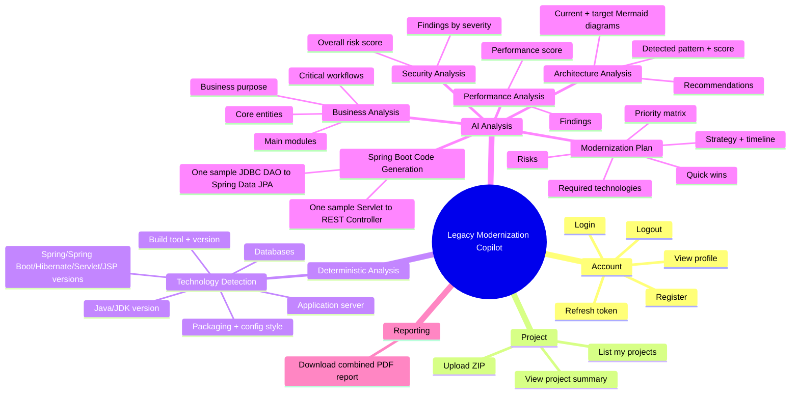
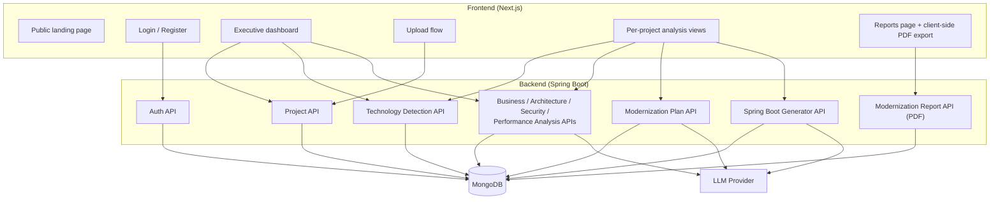

# High-Level Design (HLD)

## 1. Purpose

The AI Legacy Modernization Copilot lets a user upload a legacy enterprise Java codebase (Servlets, JSP, Struts, EJB, JDBC, COBOL/JCL, Spring MVC/XML, etc.) and, per project, run a series of independent analysis stages that together answer: *what does this system do, how is it built, what's wrong with it, and how do we modernize it to Spring Boot?*

## 2. Actors

| Actor | Description |
|---|---|
| End user | Registers/logs in, uploads a project, triggers analyses, reviews results, downloads a PDF report. The `Role` field (`ADMIN`/`ARCHITECT`/`DEVELOPER`) is captured at registration but does not currently gate any functionality — every authenticated user can do everything. |
| Backend system | Spring Boot REST API — owns all business logic, persistence, and AI orchestration. |
| LLM Provider | External OpenAI-compatible Chat Completions API, invoked by six backend "agents." |

## 3. Functional Capability Map

## 4. High-Level Component View

## 5. Core Design Decisions (as implemented)

| Decision | What the code actually does | Trade-off |
|---|---|---|
| **Replace-on-rerun, not versioned history** | Every analysis use case deletes the project's prior document for that stage (`deleteByProjectId`) before saving the new one. There is no history of past runs. | Simple, but a user cannot compare "before/after re-analysis" or see when a result changed short of the single `createdAt` timestamp. |
| **Synchronous AI calls** | Every AI-backed endpoint (`POST .../business-analysis`, `.../architecture-analysis`, etc.) blocks the HTTP request until the LLM responds. | Simple to implement/reason about; means a slow/rate-limited LLM call directly extends client-perceived latency. No queue exists (`JobQueue` is unimplemented). |
| **Independent, optional pipeline stages** | Nothing requires technology detection before business analysis, or business analysis before architecture analysis. Later stages (architecture, performance, security, the planner) *optionally* enrich their prompt with whichever prior reports already exist, but none of them require it. | Flexible for the user (any order), but means analyses can be run — and reported on — with partial context. |
| **Graceful AI degradation** | If no LLM API key is configured, `LangChain4jConfig` returns `null` beans instead of failing startup; every AI agent then throws `BusinessLogicException("AI_DISABLED")`, mapped to HTTP 422. | The app is still usable (upload, technology detection, project browsing) without an LLM key. |
| **Stateless JWT auth with DB-backed refresh** | Access tokens are pure stateless JWTs (no DB check). Refresh tokens are hashed and stored in MongoDB, single-use (rotated on every refresh), and revocable. | Fast auth checks on every request; refresh endpoint carries the extra DB round-trip and enables logout/revocation, which pure stateless refresh tokens couldn't provide. |
| **Report generation is a pure read** | `GenerateModernizationReportUseCase` performs no AI calls and persists nothing — it just assembles whichever analyses already exist into a PDF, live, on every request. | Report generation is always available and cheap, but a report for a partially-analyzed project will contain "Not yet analyzed" placeholder sections. |

## 6. Non-Functional Characteristics (as configured)

| Concern | Configuration found in code |
|---|---|
| Max upload size | `spring.servlet.multipart.max-file-size` / `max-request-size` = 1000MB (`application.yml`) |
| Extracted-project size cap | `app.project.max-extracted-size-mb` = 2000MB default (`ZipProjectExtractor`) |
| AI prompt context cap | `app.ai.max-digest-chars` = 60,000 chars, `app.ai.max-file-chars` = 6,000 chars per file (`CodeDigestBuilder`) |
| Session model | Fully stateless (`SessionCreationPolicy.STATELESS`) |
| CORS | Hardcoded to `http://localhost:3000`, `:5173`, `:9090` in `SecurityConfig` — **not environment-configurable today** |
| Request timeout to LLM | **Not configured anywhere** — no `.timeout(...)` on the LangChain4j model builder |
| Observability | Actuator endpoints `health`, `info`, `metrics`, `prometheus` exposed |

## 7. Related Documents

- [01-system-architecture.md](./01-system-architecture.md) — container/deployment view
- [03-low-level-design.md](./03-low-level-design.md) — entity/class-level detail
- [11-sequence-diagrams.md](./11-sequence-diagrams.md) — flow-by-flow sequence diagrams
