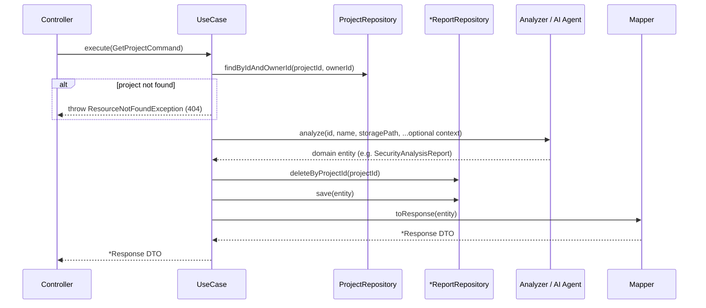
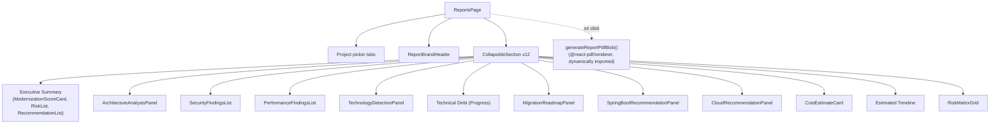

# Low-Level Design (LLD)

This document covers class-level and entity-level detail for the backend domain and application layers. All names, fields, and types below are taken directly from the source under `backend/src/main/java/com/ailegacy/modernization/copilot/`.

## 1. Domain Entity Model

Nine entities are MongoDB-persisted aggregates (`@Document`, have `@Id`); the rest are embedded value objects (no `@Id`, nested inside a parent document).

```mermaid
classDiagram
    class Project {
        +String id
        +String ownerId
        +String name
        +String originalFileName
        +String storagePath
        +long totalFiles
        +long totalFolders
        +long totalSizeBytes
        +Map~String,Long~ fileExtensionBreakdown
        +Instant createdAt
    }

    class User {
        +String id
        +String name
        +String email
        +String passwordHash
        +Role role
        +boolean enabled
        +Instant createdAt
        +Instant updatedAt
    }

    class RefreshToken {
        +String id
        +String userId
        +String tokenHash
        +Instant expiresAt
        +boolean revoked
        +Instant createdAt
    }

    class TechnologyDetectionResult {
        +String id
        +String projectId
        +List~DetectedTechnology~ detectedTechnologies
        +DetectedAttribute javaVersion
        +DetectedAttribute jdkVersion
        +DetectedAttribute buildTool
        +DetectedAttribute mavenVersion
        +DetectedAttribute gradleVersion
        +DetectedAttribute springVersion
        +DetectedAttribute springBootVersion
        +DetectedAttribute servletVersion
        +DetectedAttribute jspVersion
        +DetectedAttribute hibernateVersion
        +DetectedAttribute applicationServer
        +DetectedAttribute packaging
        +List~DetectedAttribute~ configurationStyles
        +List~DetectedAttribute~ databases
        +Instant createdAt
    }

    class BusinessAnalysisReport {
        +String id
        +String projectId
        +String businessPurpose
        +List~String~ mainModules
        +List~String~ criticalWorkflows
        +List~String~ coreEntities
        +String executiveSummary
        +String businessSummary
        +List~ModuleSummary~ moduleSummary
        +int filesAnalyzed
        +int totalProjectFiles
        +Instant createdAt
    }

    class ArchitectureAnalysisReport {
        +String id
        +String projectId
        +ArchitecturePattern detectedPattern
        +String currentArchitectureDescription
        +String currentArchitectureDiagram
        +int architectureScore
        +String architectureScoreJustification
        +List~String~ recommendations
        +ArchitecturePattern targetArchitecturePattern
        +String targetArchitectureDescription
        +String migrationDiagram
        +int filesAnalyzed
        +int totalProjectFiles
        +Instant createdAt
    }

    class SecurityAnalysisReport {
        +String id
        +String projectId
        +List~SecurityFinding~ findings
        +int overallRiskScore
        +int filesAnalyzed
        +int totalProjectFiles
        +Instant createdAt
    }

    class PerformanceAnalysisReport {
        +String id
        +String projectId
        +int performanceScore
        +String performanceScoreJustification
        +List~PerformanceFinding~ findings
        +int filesAnalyzed
        +int totalProjectFiles
        +Instant createdAt
    }

    class ModernizationPlan {
        +String id
        +String projectId
        +String migrationStrategy
        +String estimatedTimeline
        +Level migrationComplexity
        +List~PriorityMatrixItem~ priorityMatrix
        +List~String~ quickWins
        +List~Risk~ risks
        +List~RequiredTechnology~ requiredTechnologies
        +int filesAnalyzed
        +int totalProjectFiles
        +Instant createdAt
    }

    class GeneratedSpringBootCode {
        +String id
        +String projectId
        +String sourceServletReference
        +String sourceJdbcReference
        +String entityCode
        +String repositoryCode
        +String dtoCode
        +String serviceCode
        +String controllerCode
        +String explanation
        +int filesAnalyzed
        +int totalProjectFiles
        +Instant createdAt
    }

    class DetectedAttribute {
        +String value
        +int confidenceScore
        +List~String~ evidence
    }
    class DetectedTechnology {
        +TechnologyType technology
        +int confidenceScore
        +List~String~ evidence
    }
    class ModuleSummary {
        +String moduleName
        +String description
    }
    class SecurityFinding {
        +SecurityIssueType issueType
        +String title
        +String description
        +Severity severity
        +int riskScore
        +String location
        +String recommendation
        +String modernAlternative
        +List~String~ evidence
    }
    class PerformanceFinding {
        +PerformanceIssueType issueType
        +String title
        +String description
        +String location
        +String optimizationSuggestion
        +String modernAlternative
        +List~String~ evidence
    }
    class PriorityMatrixItem {
        +String item
        +Level impact
        +Level effort
    }
    class RequiredTechnology {
        +ModernTechnology technology
        +boolean recommended
        +String reason
    }
    class Risk {
        +String description
        +Level severity
    }

    Project "1" --> "1" User : ownerId
    TechnologyDetectionResult "1" --> "*" DetectedTechnology
    TechnologyDetectionResult "1" --> "*" DetectedAttribute
    BusinessAnalysisReport "1" --> "*" ModuleSummary
    SecurityAnalysisReport "1" --> "*" SecurityFinding
    PerformanceAnalysisReport "1" --> "*" PerformanceFinding
    ModernizationPlan "1" --> "*" PriorityMatrixItem
    ModernizationPlan "1" --> "*" RequiredTechnology
    ModernizationPlan "1" --> "*" Risk
```

## 2. Domain Enumerations

| Enum | Values | Fallback behavior of `fromLabel(String)` |
|---|---|---|
| `Role` | `ADMIN`, `ARCHITECT`, `DEVELOPER` | n/a (no `fromLabel`) |
| `Level` | `LOW`, `MEDIUM`, `HIGH` | Defaults to `MEDIUM` for unrecognized input |
| `Severity` | `LOW`, `MEDIUM`, `HIGH`, `CRITICAL` | Defaults to `MEDIUM` |
| `ArchitecturePattern` | `MONOLITH`, `MVC`, `LAYERED`, `CLIENT_SERVER`, `MICROSERVICE` | Throws `IllegalArgumentException` for unrecognized input |
| `ModernTechnology` | `SPRING_BOOT`, `SPRING_SECURITY`, `DOCKER`, `KUBERNETES`, `KAFKA`, `REDIS`, `OPENAPI`, `CLOUD_MIGRATION` | Throws `IllegalArgumentException` |
| `TechnologyType` | `SERVLET`, `JSP`, `SPRING_MVC`, `SPRING_XML`, `JDBC`, `HIBERNATE`, `EJB`, `COBOL`, `JCL`, `STRUTS` | n/a (no `fromLabel`) |
| `SecurityIssueType` | `SQL_INJECTION`, `HARDCODED_PASSWORD`, `WEAK_ENCRYPTION`, `MISSING_AUTHENTICATION`, `SESSION_RISK`, `OWASP_ISSUE` | Falls back to `OWASP_ISSUE` (deliberate catch-all) |
| `PerformanceIssueType` | `N_PLUS_ONE_QUERY`, `LARGE_CLASS`, `GOD_OBJECT`, `MEMORY_LEAK_RISK`, `DUPLICATE_CODE`, `BLOCKING_IO` | Throws `IllegalArgumentException` |

## 3. Domain Exceptions

| Exception | Error code | Thrown by |
|---|---|---|
| `DomainException` (base) | `DOMAIN_ERROR` | Never thrown directly — base class only |
| `ResourceNotFoundException` | `RESOURCE_NOT_FOUND` | Nearly every use case: unknown project, or "run this analysis first" when fetching a report that doesn't exist yet |
| `BusinessLogicException` | `BUSINESS_LOGIC_ERROR` (or custom, e.g. `EMAIL_ALREADY_EXISTS`, `AI_DISABLED`) | `RegisterUseCase` (duplicate email), all AI agents (no LLM key configured) |
| `UnauthorizedException` | `UNAUTHORIZED` | `LoginUseCase` (bad credentials/disabled account), `RefreshTokenUseCase` (invalid/expired/revoked/reused refresh token) |
| `AccessDeniedException` | `ACCESS_DENIED` | Defined, **not currently thrown anywhere** in the codebase |
| `ValidationException` | `VALIDATION_ERROR` | Defined, **not currently thrown anywhere** — request validation is instead handled by `MethodArgumentNotValidException` at the REST layer |

## 4. Use Case Catalog (Application Layer)

All 24 use cases implement `UseCase<Request, Response> { Response execute(Request request); }`. Every "run"-style use case follows the same **replace-on-rerun** pattern: delete any existing document for the project, run the analysis, save the new document.

| Use case | Input | Output | Behavior |
|---|---|---|---|
| `UploadProjectUseCase` | `UploadProjectCommand(file, ownerId)` | `ProjectSummaryResponse` | Generates a project ID, extracts the ZIP via `ZipProjectExtractor`, derives project name from filename, saves `Project` |
| `ListProjectsUseCase` | `ownerId` | `List<ProjectSummaryResponse>` | Lists an owner's projects, newest first |
| `GetProjectUseCase` | `GetProjectCommand(projectId, ownerId)` | `ProjectSummaryResponse` | Fetch-or-404, scoped to owner |
| `RegisterUseCase` | `RegisterRequest` | `AuthTokenResponse` | Rejects duplicate email, hashes password (BCrypt), saves `User`, issues tokens |
| `LoginUseCase` | `LoginRequest` | `AuthTokenResponse` | Verifies credentials + enabled flag, issues tokens |
| `RefreshTokenUseCase` | `RefreshTokenRequest` | `AuthTokenResponse` | Validates + revokes the presented refresh token (rotation), issues a new pair |
| `LogoutUseCase` | `RefreshTokenRequest` | `Void` | Revokes the presented refresh token; idempotent |
| `GetProfileUseCase` | `userId` (from JWT) | `UserProfileResponse` | Fetch-or-404 |
| `DetectTechnologiesUseCase` | `GetProjectCommand` | `TechnologyDetectionResponse` | Calls `TechnologyDetectionEngine` (deterministic), replace-on-rerun |
| `GetTechnologyDetectionUseCase` | `GetProjectCommand` | `TechnologyDetectionResponse` | Fetch-or-404 |
| `AnalyzeBusinessLogicUseCase` | `GetProjectCommand` | `BusinessAnalysisResponse` | Calls `BusinessLogicAnalyzer` (LLM), replace-on-rerun |
| `GetBusinessAnalysisUseCase` | `GetProjectCommand` | `BusinessAnalysisResponse` | Fetch-or-404 |
| `AnalyzeArchitectureUseCase` | `GetProjectCommand` | `ArchitectureAnalysisResponse` | Optionally enriches prompt with prior technology + business results; calls `ArchitectureAnalyzer` (LLM) |
| `GetArchitectureAnalysisUseCase` | `GetProjectCommand` | `ArchitectureAnalysisResponse` | Fetch-or-404 |
| `AnalyzeSecurityUseCase` | `GetProjectCommand` | `SecurityAnalysisResponse` | Optionally enriches with prior technology context; calls `SecurityAnalyzer` (LLM) |
| `GetSecurityAnalysisUseCase` | `GetProjectCommand` | `SecurityAnalysisResponse` | Fetch-or-404 |
| `AnalyzePerformanceUseCase` | `GetProjectCommand` | `PerformanceAnalysisResponse` | Optionally enriches with prior technology context; calls `PerformanceAnalyzer` (LLM) |
| `GetPerformanceAnalysisUseCase` | `GetProjectCommand` | `PerformanceAnalysisResponse` | Fetch-or-404 |
| `GenerateModernizationPlanUseCase` | `GetProjectCommand` | `ModernizationPlanResponse` | Builds a `ModernizationContext` summarizing whichever of technology/business/architecture/security/performance reports exist (findings capped at 3 per category in the summary), calls `ModernizationPlanner` (LLM) |
| `GetModernizationPlanUseCase` | `GetProjectCommand` | `ModernizationPlanResponse` | Fetch-or-404 |
| `GenerateSpringBootCodeUseCase` | `GetProjectCommand` | `GeneratedSpringBootCodeResponse` | Optionally enriches with prior technology context; calls `SpringBootGenerator` (LLM) — converts **one** sample Servlet and **one** sample JDBC class, not the whole project |
| `GetGeneratedSpringBootCodeUseCase` | `GetProjectCommand` | `GeneratedSpringBootCodeResponse` | Fetch-or-404 |
| `GenerateModernizationReportUseCase` | `GetProjectCommand` | `GeneratedReportFile(byte[] content, String suggestedFilename)` | Loads whichever analyses exist (no requirement that any exist), renders a PDF via `ModernizationReportPdfGenerator`. **No AI call, nothing persisted** — pure read-and-render, every time. |

## 5. Use Case Execution Pattern (Sequence)

Every "run analysis" endpoint follows this identical shape:

## 6. Mapper Layer

All 9 mappers are hand-written `@Component` classes (despite a `BaseMapper<E,D>` interface whose Javadoc suggests MapStruct — MapStruct is a declared Maven dependency but is **not actually used** by any mapper in this codebase). Each is a one-directional entity→DTO mapper:

`ProjectSummaryMapper`, `UserProfileMapper`, `TechnologyDetectionMapper`, `BusinessAnalysisMapper`, `ArchitectureAnalysisMapper`, `SecurityAnalysisMapper`, `PerformanceAnalysisMapper`, `ModernizationPlanMapper`, `GeneratedSpringBootCodeMapper`.

## 7. Frontend Component-Level Design

The frontend has no class hierarchy in the OOP sense (functional React components), but follows a consistent per-feature composition pattern. Example — the Reports page (`src/app/(dashboard)/reports/page.tsx`):

Cost estimate and the likelihood/impact risk matrix are **client-side heuristics** (`src/lib/report.ts`), not backend-computed values — they exist only in the frontend, derived from fields the backend does return (project size, migration complexity, security findings).

---

*Related documents: [06-backend-architecture.md](./06-backend-architecture.md) · [08-database-design.md](./08-database-design.md) · [09-ai-agent-design.md](./09-ai-agent-design.md)*
