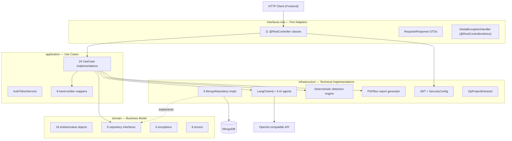
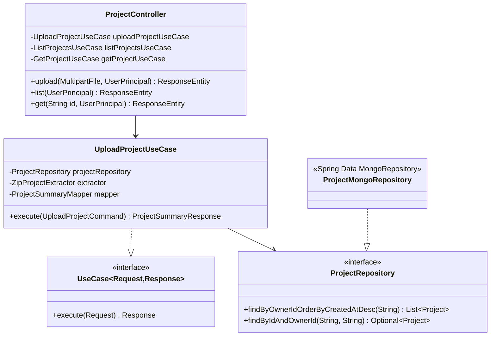

# Backend Architecture

Spring Boot 3.3.0, Java 21, following Clean Architecture as documented in `backend/ARCHITECTURE.md`. This document verifies that documentation against the actual code and calls out every place reality differs from it.

## 1. Layered View

## 2. Verified vs. Documented Structure

`backend/ARCHITECTURE.md` describes an idealized structure. Cross-checking every package against the actual source:

| Package | Documented purpose | Actual state |
|---|---|---|
| `domain.models` | "Value objects and aggregates" | **Does not exist.** Value objects live in `domain.entities` instead, as plain embedded classes. |
| `domain.services` | "Domain services encapsulating complex business logic" | Contains only `BaseDomainService`, an empty marker interface. **No implementation exists.** Business logic instead lives directly in use cases and in `infrastructure.ai`/`infrastructure.analysis` components. |
| `application.orchestrators` | "Complex workflow coordination" | Contains only `Orchestrator`, an empty marker interface. **No implementation exists.** Controllers call use cases directly; there is no multi-use-case workflow coordination layer. |
| `application.dto` | "Application DTOs" | **Exists but is empty** — zero files. All DTOs actually used are in `interfaces.rest.dto`. |
| `application.mappers` | "MapStruct" | `BaseMapper`'s Javadoc references MapStruct and `mapstruct` is a real Maven dependency, but **every actual mapper is hand-written**, none use `@Mapper`. |
| `infrastructure.storage` | "Local file system storage / AWS S3 / Azure Blob / Google Cloud Storage" | `ZipProjectExtractor` (real, local-disk-only) is the only implementation used. `ObjectStorage` — the interface implying pluggable cloud backends — has **zero implementations and zero call sites**. |
| `infrastructure.queue` | "Job queue implementations" | `JobQueue` is an interface with **zero implementations**. All analyses run synchronously in the request thread. |
| `infrastructure.logging` | "Audit and structured logging" | `AuditLogger` exists but **has zero call sites** anywhere else in the codebase. Actual logging is ad hoc `@Slf4j log.info/log.error` calls throughout, backed by `logback-spring.xml`. |

None of this is a defect in the running application — every currently-used code path works end-to-end — but it means the aspirational architecture described in `ARCHITECTURE.md` is broader than what's implemented today. See [15-future-enhancements.md](./15-future-enhancements.md) for what completing these packages would look like.

## 3. Controller → Use Case → Repository Wiring

Every controller follows the identical shape: inject the relevant `UseCase` bean(s) via constructor injection, read `@AuthenticationPrincipal UserPrincipal` for the current user's id, call `.execute(...)`, return `ResponseEntity<ApiResponse<T>>`.

## 4. Configuration Surface

| Property prefix | Purpose | Source |
|---|---|---|
| `spring.data.mongodb.*` | Connection URI (Atlas SRV in dev/prod, plain host:port in docker), database name, `auto-index-creation` (`true` everywhere except `prod`) | `application*.yml` |
| `server.*` | Port `8080`, context-path `/api`, compression enabled | `application.yml` |
| `jwt.*` | `secret`, `expiration-ms` (900000 = 15 min), `refresh-expiration-ms` (604800000 = 7 days) | `application.yml` |
| `llm.openai.*` | `api-key`, `base-url`, `model`, `temperature` (0.7 default), `max-tokens` (4096 default) | `application.yml`, `LangChain4jConfig` |
| `llm.azure.*` | Declared but **unused** — no `AzureOpenAiChatModel` bean is ever constructed | `application.yml` |
| `app.temp-directory` / `app.output-directory` | Where uploaded ZIPs are extracted / where reports would be written | Per-profile override (`./temp-uploads` dev, `/var/ai-legacy-copilot/temp` prod, `/tmp/ai-legacy-copilot` docker) |
| `app.project.*` | `supported-extensions`, `max-extracted-size-mb` (2000 default) | `application.yml`, `ZipProjectExtractor` |
| `app.ai.*` | `max-digest-chars` (60000), `max-file-chars` (6000) | `application.yml`, `CodeDigestBuilder` |
| `springdoc.*` | `/v3/api-docs`, `/swagger-ui.html`, method-sorted operations | `application.yml` |
| `management.*` | Actuator: `health`, `info`, `metrics`, `prometheus` exposed | `application.yml` |

Four Spring profiles exist: `dev` (default, verbose logging, local temp dirs), `docker` (used by `docker-compose.yml`, plain Mongo connection to the `mongo` service), `prod` (SRV Mongo URI required via env, quieter logging, indexing disabled, no JWT secret default). `backend/ARCHITECTURE.md` only documents `dev`/`prod` — the `docker` profile is real but undocumented there.

## 5. Build

- **Build tool**: Maven, `spring-boot-starter-parent:3.3.0`
- **Language level**: Java 21
- **Annotation processors**: Lombok 1.18.30, MapStruct 1.6.0 (declared, unused in practice — see §2)
- **Packaging**: `spring-boot-maven-plugin`, excludes Lombok from the fat jar

See [14-technology-stack.md](./14-technology-stack.md) for the full dependency list with exact versions.

---

*Related documents: [03-low-level-design.md](./03-low-level-design.md) · [09-ai-agent-design.md](./09-ai-agent-design.md) · [10-api-documentation.md](./10-api-documentation.md) · [13-security-architecture.md](./13-security-architecture.md)*
