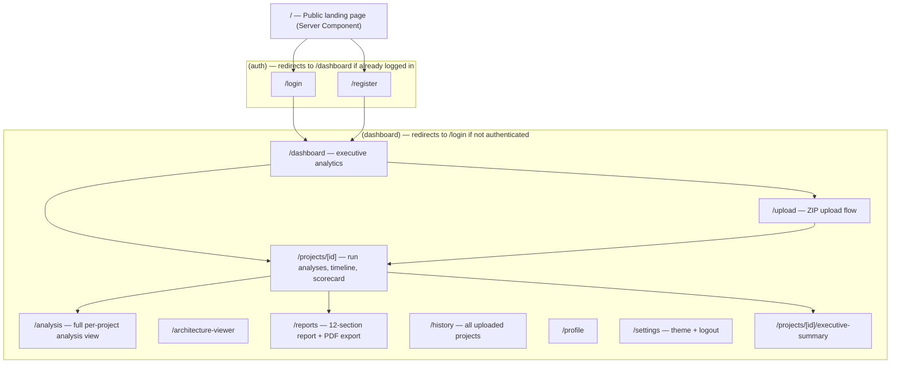
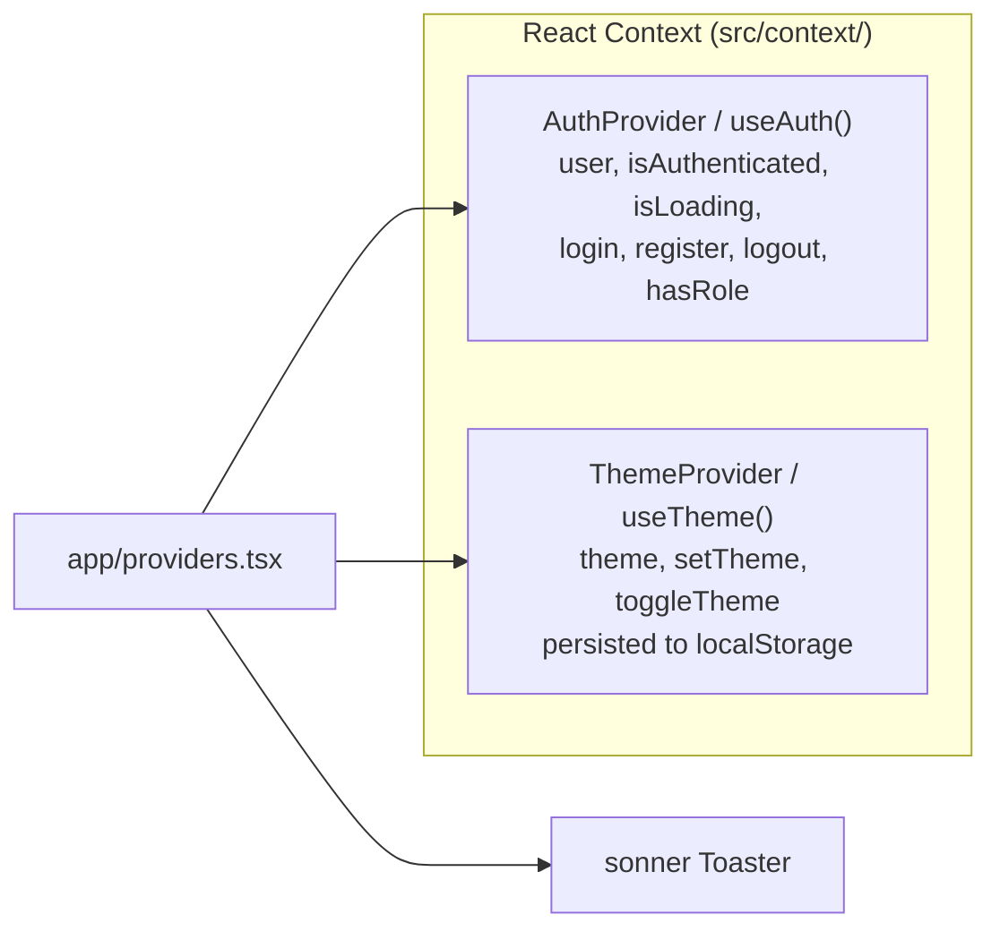
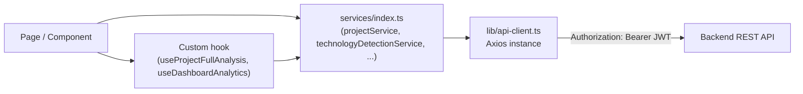

# Frontend Architecture

Next.js 14.1 (App Router), React 18.2, TypeScript 5.3, Tailwind CSS 3.4. Deployed as a standalone Node.js server (`output: 'standalone'` in `next.config.mjs`).

## 1. Route Map

19 route files total. No `middleware.ts` exists — authentication gating is done client-side, inside `(auth)/layout.tsx` and `(dashboard)/layout.tsx`, both of which read `useAuth()` and call `router.replace(...)`.

## 2. Rendering Model

| Route | Component type | Notes |
|---|---|---|
| `/` (landing) | Server Component | Statically prerendered; composes client sub-components (`Reveal`, `LandingNav`) only where interactivity is needed |
| `layout.tsx` (root) | Server Component | Injects a pre-hydration inline script to avoid a dark-mode flash-of-wrong-theme |
| Everything under `(auth)` and `(dashboard)` | Client Components (`'use client'`) | All data fetching is client-side via `useEffect` + Axios; no server actions or route handlers exist in this app |

There are no Next.js API route handlers (`route.ts`) anywhere — the frontend is a pure client to the separate Spring Boot backend.

## 3. State Management

**No Redux or Zustand store is actually wired up**, despite `zustand@4.4.1` being listed as a dependency in `package.json` — a repo-wide search found zero `create()` store definitions using it. All application state is either local component `useState`/`useEffect` or one of the two React Contexts above.

## 4. Data Layer

- **`src/services/index.ts`**: one object per backend feature area (`authService`, `projectService`, `technologyDetectionService`, `architectureAnalysisService`, `modernizationPlanService`, `businessAnalysisStatusService`, `securityAnalysisStatusService`, `performanceAnalysisStatusService`, `springBootGenerationStatusService`, `modernizationReportService`), each a thin typed wrapper around an Axios call to a path from `src/constants/index.ts`'s `API_ENDPOINTS`.
- Three additional service objects (`scanService`, `analysisService`, `reportService`) exist for a `/scans/*`-based API shape that does not correspond to any controller found in the current backend — these appear to be vestigial from an earlier API design and are not exercised by any page.
- **`src/hooks/use-project-full-analysis.ts`**: fetches a project plus every analysis stage in parallel, tolerating 404s (stage not yet run) via a `settle()` helper; exposes a `reload()` for retry buttons.
- **`src/hooks/use-dashboard-analytics.ts`**: fetches every project's every analysis stage and aggregates client-side metrics/chart data — no backend aggregation endpoint exists for this.

## 5. Design System

`src/components/ui/` holds hand-rolled, shadcn/ui-style primitives (not the shadcn CLI — no `components.json` exists) built on `class-variance-authority`, `tailwind-merge`, and `@radix-ui/react-slot`:

| Primitive | Purpose |
|---|---|
| `Button` / `buttonVariants` | cva-based variant/size system, `asChild` support via Radix `Slot` |
| `Card`, `CardHeader`, `CardTitle`, `CardContent`, `CardFooter` | Layout primitives |
| `Dialog` family | Wraps `@radix-ui/react-dialog` |
| `Progress` | Determinate (0–100) and indeterminate (sweeping) variants |
| `Skeleton`, `CardGridSkeleton`, `PanelSkeleton` | Loading placeholders |
| `EmptyState` | Illustration + title + description + action, used for every "no data yet" state |
| `ErrorState` | Failed-to-load message with a built-in retry button |
| `EmptyProjectsIllustration`, `EmptyAnalysisIllustration`, `EmptyReportIllustration` | Composed icon-tile illustrations (no external image assets — `public/` is empty) |

Theming: HSL CSS custom properties in `src/styles/globals.css`, toggled via Tailwind's `darkMode: 'class'` strategy. Custom keyframes (`fade-in-up`, `pop-in`, `fade-in`, `float`, `progress-indeterminate`, `upload-bounce`) are hand-written in `globals.css`, not part of `tailwind.config.js`'s theme — the Tailwind config itself only defines `accordion-down`/`accordion-up` for Radix accordion support.

## 6. Notable Libraries in Use

| Library | Used for |
|---|---|
| `axios` | HTTP client |
| `react-hook-form` + `zod` | Login/register form validation |
| `lucide-react` | Icon set, used throughout |
| `recharts` | Dashboard charts |
| `mermaid` | Rendering AI-generated architecture diagrams |
| `react-flow-renderer` | (declared dependency; not confirmed wired into any current page during this audit) |
| `sonner` | Toast notifications |
| `@react-pdf/renderer` | Client-side, dynamically-imported PDF generation for the Reports page (kept out of the initial bundle) |
| `date-fns` | Date formatting |

## 7. Testing

`jest.config.js` and `jest.setup.js` are present and `jest`, `jest-environment-jsdom`, `@testing-library/react`, `@testing-library/jest-dom` are installed — but **zero test files exist** anywhere under `src/`. Test infrastructure is fully configured and unused. See [15-future-enhancements.md](./15-future-enhancements.md).

## 8. Build & Deployment

- `next.config.mjs`: `output: 'standalone'`, `reactStrictMode: true`, `swcMinify: true`; a `rewrites()` block proxies `/api/*` to `http://localhost:8080/api/*` (hardcoded, dev-only — production deployments rely on `NEXT_PUBLIC_API_BASE_URL` instead, read directly by the Axios client).
- `Dockerfile`: three-stage build (`deps` → `build` → `runtime`) on `node:20-alpine`, runs as non-root user `nextjs`, exposes port 3000.
- Because of `output: 'standalone'`, static assets (`.next/static`, `public/`) must be copied into `.next/standalone` manually after `next build` if not using the Docker image — this is required infrastructure, not a bug.

---

*Related documents: [03-low-level-design.md](./03-low-level-design.md) · [05-module-overview.md](./05-module-overview.md) · [14-technology-stack.md](./14-technology-stack.md)*
