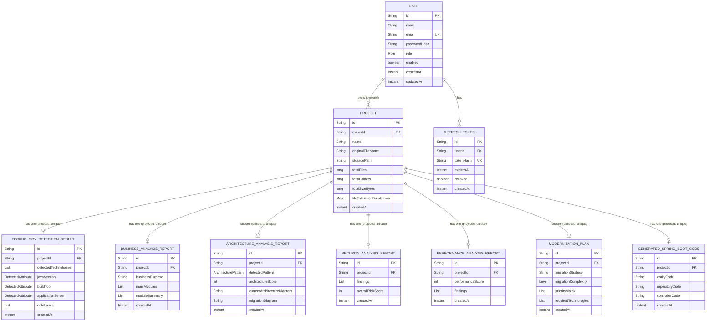

# Database Design

MongoDB 7 (document store), accessed via Spring Data MongoDB. **10 collections**, confirmed from `@Document(collection = "...")` annotations on the domain entities.

## 1. Collection Catalog

| Collection | Entity | Unique index | Purpose |
|---|---|---|---|
| `users` | `User` | `email` | Authentication accounts |
| `refresh_tokens` | `RefreshToken` | `tokenHash` | Hashes of active/revoked refresh tokens (raw tokens are never stored) |
| `projects` | `Project` | — (`ownerId` indexed, non-unique) | Uploaded legacy codebases and their extraction metadata |
| `technology_detections` | `TechnologyDetectionResult` | `projectId` | Deterministic technology-detection results |
| `business_analysis_reports` | `BusinessAnalysisReport` | `projectId` | AI-generated business analysis |
| `architecture_analysis_reports` | `ArchitectureAnalysisReport` | `projectId` | AI-generated architecture analysis |
| `security_analysis_reports` | `SecurityAnalysisReport` | `projectId` | AI-generated security findings |
| `performance_analysis_reports` | `PerformanceAnalysisReport` | `projectId` | AI-generated performance findings |
| `modernization_plans` | `ModernizationPlan` | `projectId` | AI-generated modernization roadmap |
| `generated_spring_boot_code` | `GeneratedSpringBootCode` | `projectId` | AI-generated sample Spring Boot conversion |

Every analysis collection is keyed 1:1 with a `Project` via a **unique** index on `projectId` — a project can have at most one current document per analysis type. Re-running an analysis deletes the old document first (`deleteByProjectId`), so **no history of previous runs is retained**.

`auto-index-creation` is `true` in the `dev`/`docker` profiles and explicitly `false` in `prod` (indexes must be created out-of-band before a production deploy).

## 2. Entity-Relationship Diagram



**Note on "FK"**: MongoDB has no enforced foreign keys. `ownerId`/`projectId`/`userId` fields are plain string references, application-enforced by each use case (e.g. `ProjectRepository.findByIdAndOwnerId` scopes every project lookup to its owner; every analysis use case looks up the project first and 404s if it doesn't belong to the caller).

## 3. Document Shape Example

`technology_detections` (one document per project), reflecting `TechnologyDetectionResult`:

```json
{
  "_id": "…",
  "projectId": "…",
  "detectedTechnologies": [
    { "technology": "SERVLET", "confidenceScore": 85, "evidence": ["web.xml servlet-mapping found", "..."] }
  ],
  "javaVersion": { "value": "8", "confidenceScore": 60, "evidence": ["pom.xml <source>1.8</source>"] },
  "buildTool": { "value": "Maven", "confidenceScore": 95, "evidence": ["pom.xml present"] },
  "applicationServer": { "value": "Apache Tomcat", "confidenceScore": 70, "evidence": ["..."] },
  "databases": [{ "value": "MySQL", "confidenceScore": 80, "evidence": ["jdbc:mysql:// found in ..."] }],
  "configurationStyles": ["…"],
  "createdAt": "2026-01-01T00:00:00Z"
}
```

Every `DetectedAttribute` (and equivalently every embedded value object across the other collections — `SecurityFinding`, `PerformanceFinding`, `Risk`, etc.) is stored **inline/embedded**, not as a separate collection or reference — consistent with MongoDB's document-oriented model and with the fact that these value objects have no `@Id` of their own.

## 4. Why Document-Per-Analysis-Type

This schema choice (one collection per analysis type, rather than one big `Project` document with embedded sub-reports, or a generic `AnalysisResult` collection with a `type` discriminator) has direct consequences visible in the code:

- Each `*ReportRepository` is trivial (`findByProjectId`/`deleteByProjectId`) and independently indexed.
- Analyses can be added, re-run, or deleted independently without touching the `Project` document itself.
- The trade-off: fetching a "full picture" of one project (as the frontend's `useProjectFullAnalysis` hook and the backend's `GenerateModernizationReportUseCase` both do) requires up to seven separate lookups, tolerating any of them being absent (404 → `null`). Both of these code paths use exactly this "try all seven, tolerate missing" pattern.

---

*Related documents: [03-low-level-design.md](./03-low-level-design.md) · [06-backend-architecture.md](./06-backend-architecture.md)*
