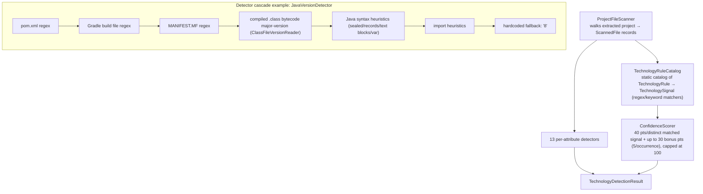
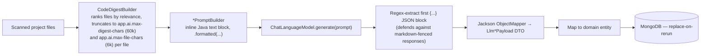
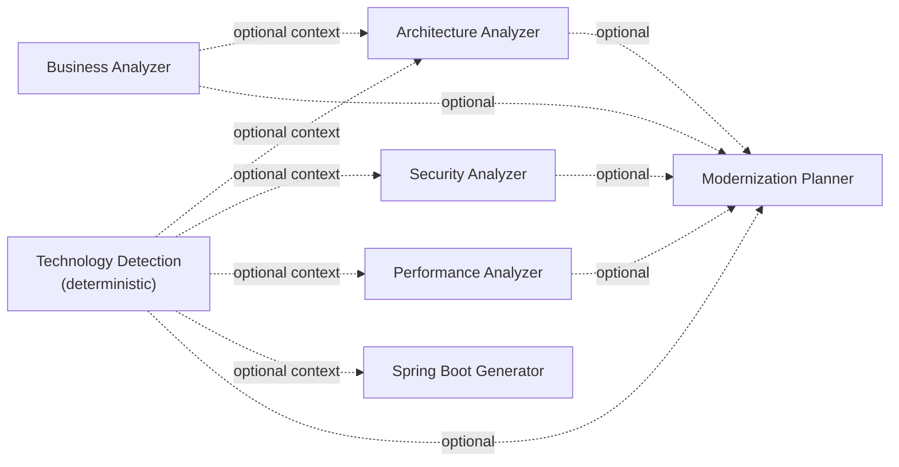

# AI Agent Design

This system has **two distinct analysis subsystems** that are easy to conflate but are architecturally separate in the code. This document covers both, precisely.

## 1. Deterministic Technology Detection (`infrastructure/analysis/`) — Not AI

Confirmed by reading the code: **zero LLM calls** happen anywhere in this package. `TechnologyDetectionEngine`'s own Javadoc states it is "a single, self-contained pipeline stage."



The 13 detectors: `JavaVersionDetector`, `JdkVersionDetector`, `DatabaseDetector`, `BuildToolDetector`, `ApplicationServerDetector`, `MavenVersionDetector`, `GradleVersionDetector`, `SpringVersionDetector`, `SpringBootVersionDetector`, `ServletVersionDetector`, `JspVersionDetector`, `HibernateVersionDetector`, `PackagingDetector`, `ConfigurationStyleDetector`.

Every detected value carries a `confidenceScore` (0–100) and an `evidence` list (which files/patterns triggered the detection) — this is why the frontend can render confidence bars and "why we think this" tooltips without any AI involvement.

## 2. LLM-Driven Agents (`infrastructure/ai/`) — Real AI

Six `@Component` agents, all sharing one shape and one LLM configuration.

### 2.1 LLM Configuration

`LangChain4jConfig` defines two beans:

| Bean | Implementation | Notes |
|---|---|---|
| `ChatLanguageModel` | `dev.langchain4j.model.openai.OpenAiChatModel` | The only chat model actually wired up |
| `EmbeddingModel` | `dev.langchain4j.model.openai.OpenAiEmbeddingModel` (`text-embedding-3-small`, hardcoded) | Declared; no code in the repository was found to actually call it (no RAG/vector-search feature exists yet) |

Configuration (`application.yml`, overridable via env vars):

| Property | Env var | Default |
|---|---|---|
| `llm.openai.api-key` | `OPENAI_API_KEY` | *(none — required)* |
| `llm.openai.base-url` | `OPENAI_BASE_URL` | *(empty — uses LangChain4j's default OpenAI endpoint unless set)* |
| `llm.openai.model` | `OPENAI_MODEL` / `LLM_MODEL` | `gpt-4` |
| `llm.openai.temperature` | `LLM_TEMPERATURE` | `0.7` |
| `llm.openai.max-tokens` | `LLM_MAX_TOKENS` | `4096` |

**Azure OpenAI is not actually wired up.** `langchain4j-azure-open-ai` is a declared Maven dependency and `llm.azure.*` properties exist in `application.yml`, but no Java class anywhere constructs an `AzureOpenAiChatModel` — this is configured-but-dead scaffolding.

**No LLM request timeout is configured anywhere** in the codebase (no `.timeout(...)` call, no `llm.*.timeout` property) — a slow or hanging LLM call has no server-side cutoff today.

**Graceful degradation**: if `OPENAI_API_KEY` is blank, both beans resolve to `null` instead of failing application startup. Every agent checks for this and throws `BusinessLogicException("AI features are disabled because no LLM API key is configured", "AI_DISABLED")` (mapped to HTTP 422) — the rest of the application (upload, browsing, technology detection) remains fully usable without an LLM key.

### 2.2 The Six Agents



| Agent | Prompt builder | Structured output (`Llm*Payload`) | Persisted as |
|---|---|---|---|
| `BusinessLogicAnalyzer` | `BusinessAnalyzerPromptBuilder` | `businessPurpose`, `executiveSummary`, `businessSummary`, `mainModules[]`, `criticalWorkflows[]`, `coreEntities[]`, `moduleSummary[]` | `BusinessAnalysisReport` |
| `ArchitectureAnalyzer` | `ArchitectureAnalyzerPromptBuilder` | `detectedPattern`, description, current-state Mermaid diagram, `architectureScore` (0–100), justification, `recommendations[]`, `targetArchitecturePattern`, target description, migration Mermaid diagram | `ArchitectureAnalysisReport` |
| `SecurityAnalyzer` | `SecurityAnalyzerPromptBuilder` | `findings[]` — each with `issueType`, `title`, `description`, `severity`, `riskScore`, `location`, `recommendation`, `modernAlternative`, `evidence[]` | `SecurityAnalysisReport` |
| `PerformanceAnalyzer` | `PerformanceAnalyzerPromptBuilder` | `performanceScore`, justification, `findings[]` (`issueType`, `title`, `description`, `location`, `optimizationSuggestion`, `modernAlternative`, `evidence[]`) | `PerformanceAnalysisReport` |
| `ModernizationPlanner` | `ModernizationPlannerPromptBuilder` | `migrationStrategy`, `estimatedTimeline`, `migrationComplexity`, `priorityMatrix[]`, `quickWins[]`, `risks[]`, `requiredTechnologies[]` | `ModernizationPlan` |
| `SpringBootGenerator` | `SpringBootGeneratorPromptBuilder` | `sourceServletReference`, `sourceJdbcReference`, `entityCode`, `repositoryCode`, `dtoCode`, `serviceCode`, `controllerCode`, `explanation` | `GeneratedSpringBootCode` |

### 2.3 Prompt Engineering Approach

- **Style**: 100% inline Java text blocks (`"""…"""`), each ending with an explicit instruction to respond with *only* a raw JSON object matching an exact key list.
- **Not used**: LangChain4j's `@SystemMessage`/`@UserMessage` annotated-interface (`AiServices`) pattern — zero matches in the codebase. No external prompt template files (`.txt`/`.st`/`.mustache`) exist either; prompts are not externalized/hot-swappable today.
- **Defensive parsing**: because LLMs sometimes wrap JSON in markdown code fences or add prose, every agent regex-extracts the first `{...}` block (`DOTALL` mode) before handing it to Jackson.

Representative excerpt (`SecurityAnalyzerPromptBuilder`):

```java
return """
        You are a Security Analyzer inside a legacy application modernization tool. You specialize in
        finding security vulnerabilities in legacy Java/JSP/COBOL/JCL/XML/SQL codebases and recommending
        modern Spring Security-based remediations.

        You will be given a sample of source files extracted from an uploaded legacy project named "%s".
        ...
        """.formatted(...)
```

### 2.4 Context Enrichment Between Agents

Later-stage agents *optionally* receive summaries of earlier analyses as extra prompt context — but none of them **require** an earlier stage to have run:



The `ModernizationPlanner` is the most context-hungry: `GenerateModernizationPlanUseCase` builds a `ModernizationContext` from whichever of the five prior reports exist, summarizing security/performance findings down to the top 3 each (`MAX_FINDINGS_IN_SUMMARY = 3`) to keep the prompt bounded.

### 2.5 Scope Boundaries (by design, not limitation)

- **Technology detection never triggers architecture analysis** — each pipeline stage is independently user-triggered.
- **Spring Boot code generation converts one representative Servlet and one representative JDBC class**, not the whole project — explicitly documented in the code's own Javadoc as a demonstrative sample, not a full-project migration.
- **The Modernization Report generates no new AI content** — it is a pure aggregation/rendering step over whatever's already been analyzed.

---

*Related documents: [02-high-level-design.md](./02-high-level-design.md) · [03-low-level-design.md](./03-low-level-design.md) · [11-sequence-diagrams.md](./11-sequence-diagrams.md)*
