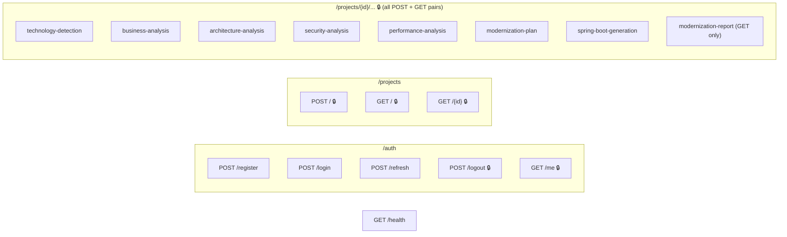

# API Documentation

Base URL: `http://<host>:8080/api` (`server.servlet.context-path: /api`). All request/response bodies are JSON unless noted. Interactive docs are auto-generated by springdoc-openapi and served at `/api/swagger-ui.html` (UI) and `/api/v3/api-docs` (raw OpenAPI JSON) — both public.

## Response Envelope

Every endpoint except `GET /health` and `GET /projects/{id}/modernization-report` returns:

```json
{
  "success": true,
  "message": "Operation completed successfully",
  "data": { "...": "..." },
  "errors": null,
  "errorCode": null,
  "timestamp": "2026-01-01T00:00:00"
}
```

On failure, `success: false`, `data: null`, `message`/`errorCode` describe the failure, and `errors` may contain a list of field-level validation messages.

## Authentication

Except for the public paths listed below, every endpoint requires `Authorization: Bearer <accessToken>`. Tokens are issued by `/auth/login`, `/auth/register`, or `/auth/refresh`.

**Public paths** (no token required): `POST /auth/register`, `POST /auth/login`, `POST /auth/refresh`, `GET /health`, `/v3/api-docs/**`, `/swagger-ui/**`.

> **Note on authorization**: the `Role` enum (`ADMIN`/`ARCHITECT`/`DEVELOPER`) exists and is embedded in every JWT, but **no endpoint currently restricts access by role** — any authenticated user can call every non-public endpoint. See [13-security-architecture.md](./13-security-architecture.md).

---

## Auth — `/auth`

| Method | Path | Auth | Request body | Success | Description |
|---|---|---|---|---|---|
| POST | `/auth/register` | public | `{ name, email, password, role }` | 201, `AuthTokenResponse` | Creates a user, returns an initial token pair |
| POST | `/auth/login` | public | `{ email, password }` | 200, `AuthTokenResponse` | Authenticates, returns a token pair |
| POST | `/auth/refresh` | public | `{ refreshToken }` | 200, `AuthTokenResponse` | Rotates the refresh token, returns a new pair |
| POST | `/auth/logout` | **required** | `{ refreshToken }` | 200, `null` | Revokes the presented refresh token (idempotent) |
| GET | `/auth/me` | required | — | 200, `UserProfileResponse` | Returns the authenticated user's profile |

`AuthTokenResponse`: `{ accessToken, refreshToken, tokenType: "Bearer", expiresIn, user: UserProfileResponse }`
`UserProfileResponse`: `{ id, name, email, role, createdAt }`

---

## Projects — `/projects`

| Method | Path | Auth | Request | Success | Description |
|---|---|---|---|---|---|
| POST | `/projects` | required | `multipart/form-data`, field `file` (ZIP) | 201, `ProjectSummaryResponse` | Uploads and extracts a project archive |
| GET | `/projects` | required | — | 200, `List<ProjectSummaryResponse>` | Lists the caller's projects, newest first |
| GET | `/projects/{id}` | required | — | 200, `ProjectSummaryResponse` | Returns one project's summary |

`ProjectSummaryResponse`: `{ id, name, originalFileName, totalFiles, totalFolders, totalSizeBytes, fileExtensionBreakdown, createdAt }`

---

## Technology Detection — `/projects/{projectId}/technology-detection`

| Method | Auth | Success | Description |
|---|---|---|---|
| POST | required | 201, `TechnologyDetectionResponse` | Runs deterministic detection, replaces any prior result |
| GET | required | 200, `TechnologyDetectionResponse` | Returns the most recent result (404 if never run) |

## Business Analysis — `/projects/{projectId}/business-analysis`

| Method | Auth | Success | Description |
|---|---|---|---|
| POST | required | 201, `BusinessAnalysisResponse` | Runs the AI business-logic agent |
| GET | required | 200, `BusinessAnalysisResponse` | Returns the most recent result |

## Architecture Analysis — `/projects/{projectId}/architecture-analysis`

| Method | Auth | Success | Description |
|---|---|---|---|
| POST | required | 201, `ArchitectureAnalysisResponse` | Runs the AI architecture agent |
| GET | required | 200, `ArchitectureAnalysisResponse` | Returns the most recent result |

## Security Analysis — `/projects/{projectId}/security-analysis`

| Method | Auth | Success | Description |
|---|---|---|---|
| POST | required | 201, `SecurityAnalysisResponse` | Runs the AI security agent |
| GET | required | 200, `SecurityAnalysisResponse` | Returns the most recent result |

## Performance Analysis — `/projects/{projectId}/performance-analysis`

| Method | Auth | Success | Description |
|---|---|---|---|
| POST | required | 201, `PerformanceAnalysisResponse` | Runs the AI performance agent |
| GET | required | 200, `PerformanceAnalysisResponse` | Returns the most recent result |

## Modernization Plan — `/projects/{projectId}/modernization-plan`

| Method | Auth | Success | Description |
|---|---|---|---|
| POST | required | 201, `ModernizationPlanResponse` | Runs the AI planner, folding in any prior analyses |
| GET | required | 200, `ModernizationPlanResponse` | Returns the most recent plan |

## Spring Boot Generation — `/projects/{projectId}/spring-boot-generation`

| Method | Auth | Success | Description |
|---|---|---|---|
| POST | required | 201, `GeneratedSpringBootCodeResponse` | Generates a sample Servlet→Controller and JDBC→JPA conversion |
| GET | required | 200, `GeneratedSpringBootCodeResponse` | Returns the most recent generated sample |

## Modernization Report — `/projects/{projectId}/modernization-report`

| Method | Auth | Success | Description |
|---|---|---|---|
| GET | required | 200, raw `application/pdf` bytes (`Content-Disposition: attachment`) | Assembles every existing analysis into a downloadable PDF. **Not** wrapped in `ApiResponse`. No prior analysis is required — missing sections render as placeholders. |

## Health — `/health`

| Method | Auth | Success | Description |
|---|---|---|---|
| GET | public | 200, raw JSON (**not** `ApiResponse`) | `{ status: "UP", service, version, environment, timestamp }` |

---

## Full Endpoint Summary



## Request DTO Validation Rules

| DTO | Field | Rule |
|---|---|---|
| `LoginRequest` | `email` | `@NotBlank`, `@Email` |
| | `password` | `@NotBlank` |
| `RegisterRequest` | `name` | `@NotBlank`, `@Size(max=100)` |
| | `email` | `@NotBlank`, `@Email` |
| | `password` | `@NotBlank`, `@Size(min=8, max=100)` |
| | `role` | `@NotNull` |
| `RefreshTokenRequest` | `refreshToken` | `@NotBlank` |

Validation failures return HTTP 400 with `errorCode: "VALIDATION_ERROR"` and a per-field `errors` array (built by `GlobalExceptionHandler` from `MethodArgumentNotValidException`).

## Error Responses

| Exception | HTTP | `errorCode` |
|---|---|---|
| `ResourceNotFoundException` | 404 | `RESOURCE_NOT_FOUND` |
| `ValidationException`* | 400 | `VALIDATION_ERROR` |
| `BusinessLogicException` | 422 | `BUSINESS_LOGIC_ERROR` (or a custom code, e.g. `EMAIL_ALREADY_EXISTS`, `AI_DISABLED`) |
| `UnauthorizedException` | 401 | `UNAUTHORIZED` |
| `AccessDeniedException`* (domain) | 403 | `ACCESS_DENIED` |
| Spring Security `AuthenticationException` | 401 | `UNAUTHORIZED` (via `RestAuthenticationEntryPoint`) |
| Spring Security `AccessDeniedException` | 403 | `ACCESS_DENIED` (via `RestAccessDeniedHandler`) |
| `MethodArgumentNotValidException` | 400 | `VALIDATION_ERROR` |
| `HttpMessageNotReadableException` | 400 | `MALFORMED_REQUEST` |
| Any other `Exception` | 500 | `INTERNAL_SERVER_ERROR` |

*Defined but not currently thrown by any use case in this codebase — listed for completeness since `GlobalExceptionHandler` does handle them.

---

*Related documents: [11-sequence-diagrams.md](./11-sequence-diagrams.md) · [13-security-architecture.md](./13-security-architecture.md)*
