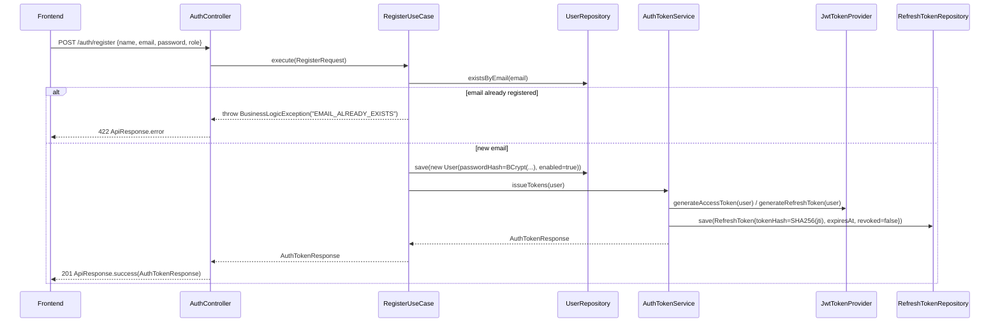
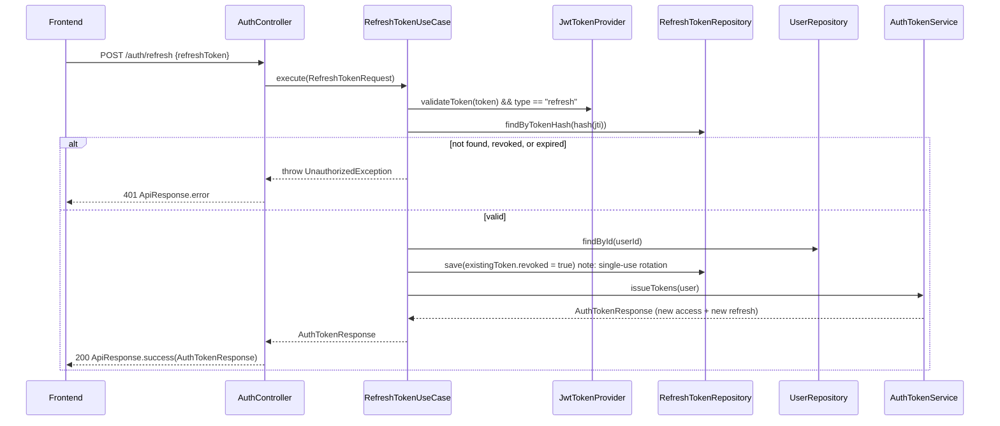
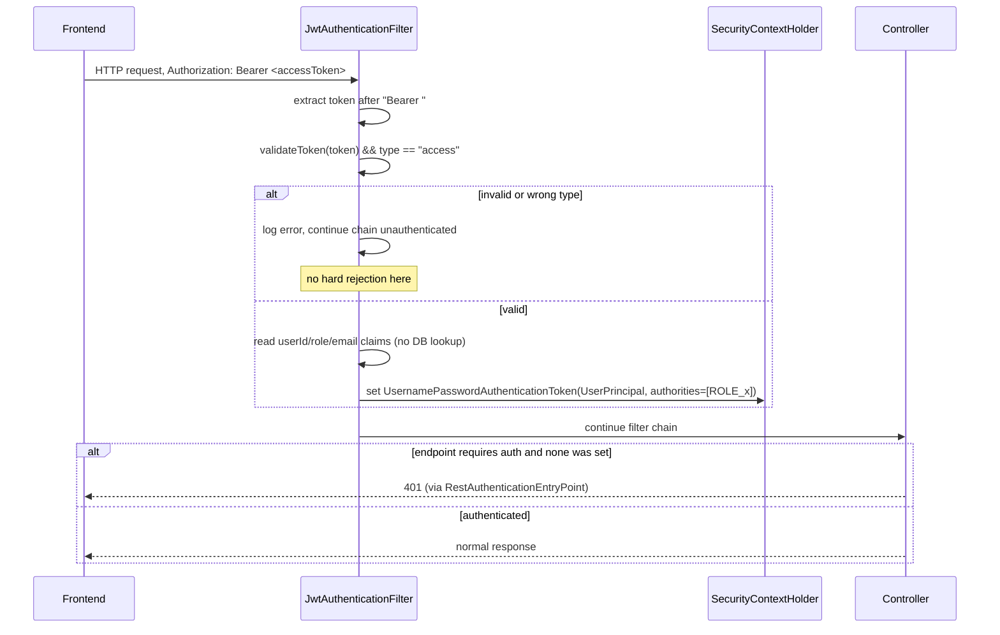
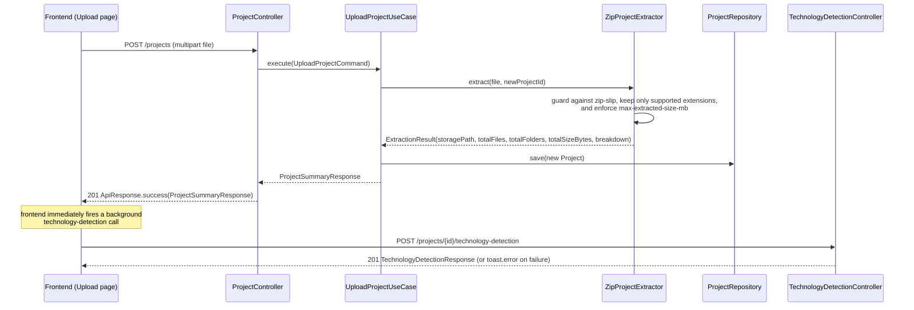
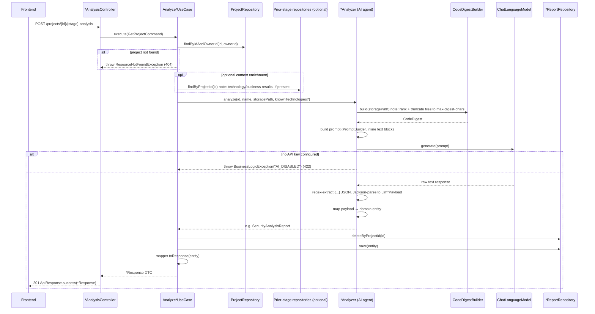
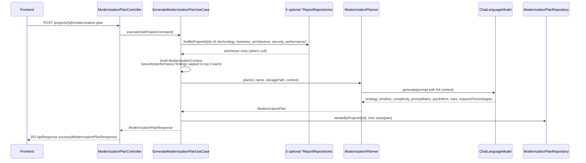
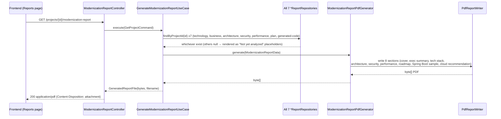

# Sequence Diagrams

Flow-by-flow detail for the system's core operations, derived from the actual controller/use-case/repository call chains.

## 1. Registration & Login

## 2. Token Refresh (Rotation)

## 3. Every Authenticated Request

## 4. Project Upload

## 5. AI-Backed Analysis (representative of all six agents)

## 6. Modernization Plan (Multi-Source Context)

## 7. Modernization Report (PDF, No AI Call)

Note: the frontend Reports page **also** has an independent, client-side PDF generation path (`src/lib/report-pdf.tsx`, using `@react-pdf/renderer`) that builds a differently-styled, branded PDF directly in the browser from already-fetched JSON data, without calling this backend endpoint. Both PDF paths exist in the codebase; the project-detail page's "Download PDF Report" button calls the backend endpoint above, while the Reports page's "Download Professional PDF" button uses the client-side path.

---

*Related documents: [09-ai-agent-design.md](./09-ai-agent-design.md) · [10-api-documentation.md](./10-api-documentation.md)*
