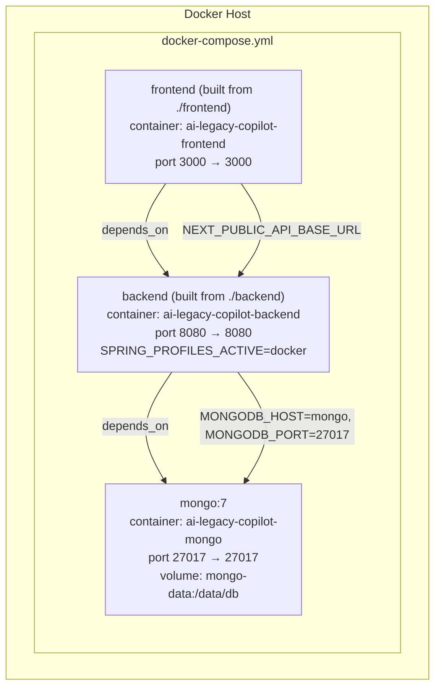
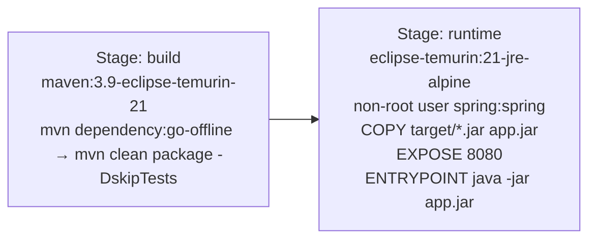
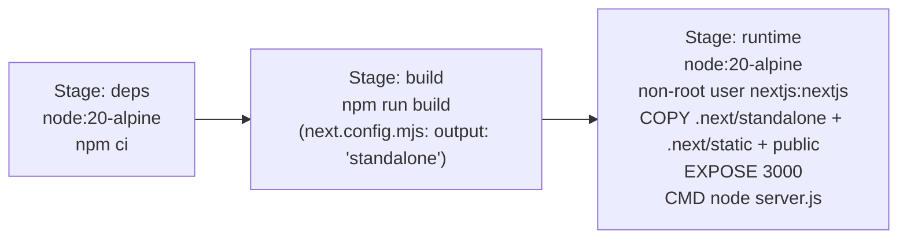
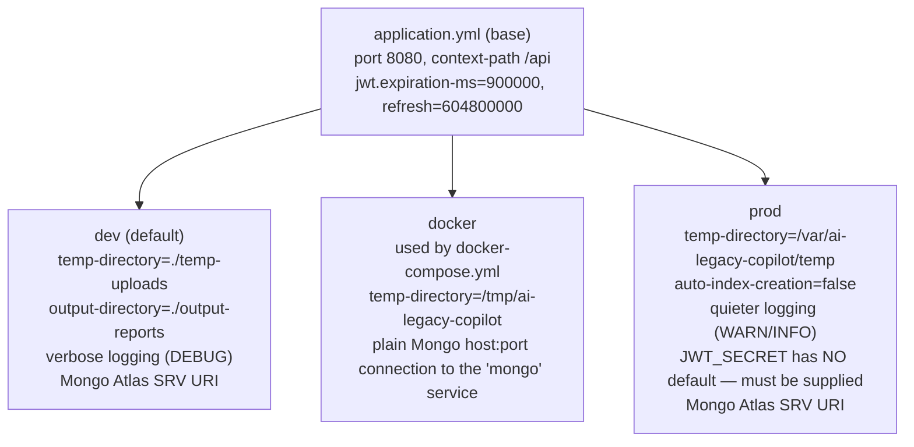

# Deployment Architecture

## 1. Local / Reference Deployment: `docker-compose.yml`

This is the only deployment topology actually defined as code in this repository.

Environment variables consumed by the `backend` service (with defaults from `docker-compose.yml`):

| Variable | Default | Purpose |
|---|---|---|
| `MONGODB_DATABASE` | `ai_legacy_modernization` | Database name |
| `JWT_SECRET` | *(insecure placeholder — override in real use)* | JWT signing key |
| `APP_ADMIN_PASSWORD` | `admin123` | Spring Security basic-auth admin password (unrelated to the app's own JWT users) |
| `OPENAI_API_KEY` | *(empty)* | Enables the six AI agents when set |

Environment variables consumed by the `frontend` service:

| Variable | Default |
|---|---|
| `NEXT_PUBLIC_API_BASE_URL` | `http://localhost:8080/api` |

## 2. Container Build Pipelines

### Backend (`backend/Dockerfile`)

### Frontend (`frontend/Dockerfile`)

Both images run as a **non-root user** and use **multi-stage builds** to keep the final image free of build tooling.

## 3. Spring Profiles

Four profiles select different infrastructure targets for the same application code:

`backend/ARCHITECTURE.md` documents only `dev`/`prod`; the `docker` profile is real (used by the compose file) but undocumented there.

## 4. Known Production Deployment Target

> The information in this section is **not** derived from configuration files in this repository — no Northflank-specific manifest, Procfile, or platform config exists in-repo at the time of writing. It is included because it reflects this project's actual operating history and is directly relevant to anyone maintaining it.

This application has, in practice, been deployed to **Northflank**, using the same generic Docker images described above (Northflank builds and runs arbitrary Dockerfiles/containers, so no additional in-repo configuration was required). Two points worth knowing if you deploy there:

- **Backend startup ordering**: Tomcat's real bind is deferred until after all Spring beans construct. A `MongoClient` bean's synchronous SRV DNS lookup, or an eagerly-constructed bean that depends on a `ChatLanguageModel`, can therefore delay or hang the perceived "startup" on some networks — worth watching for in health-check timeouts.
- **Frontend runtime footprint**: on a memory-constrained host, running `next start` (or `next dev`) directly is heavier than using the `output: 'standalone'` build (`node .next/standalone/server.js`), which is what the frontend `Dockerfile` already does.

## 5. Observability

| Endpoint | Purpose |
|---|---|
| `GET /api/health` (custom) | Simple `{status, service, version, environment, timestamp}` — public |
| `GET /api/actuator/health` | Spring Boot Actuator health |
| `GET /api/actuator/info` | Build/app info |
| `GET /api/actuator/metrics` | Micrometer metrics |
| `GET /api/actuator/prometheus` | Prometheus scrape endpoint (`management.metrics.export.prometheus.enabled: true`) |

No log-aggregation or APM integration (e.g. ELK, Datadog) was found configured in the codebase — logging is SLF4J/Logback to console and/or a rolling file (`logging.file.name`, set per profile), per `logback-spring.xml`.

## 6. What's Missing for a Full Production Pipeline

Documented here as fact-based gaps (see [15-future-enhancements.md](./15-future-enhancements.md) for the fuller list):

- No CI/CD — no `.github/workflows` directory exists.
- No infrastructure-as-code (Terraform/Pulumi/CloudFormation) in-repo.
- No secrets manager integration — secrets are plain environment variables.
- CORS origins are hardcoded Java literals (`http://localhost:3000/:5173/:9090`) in `SecurityConfig`, not environment-driven — this needs a code change, not just a config change, to support a real production frontend origin.

---

*Related documents: [06-backend-architecture.md](./06-backend-architecture.md) · [13-security-architecture.md](./13-security-architecture.md) · [14-technology-stack.md](./14-technology-stack.md)*
