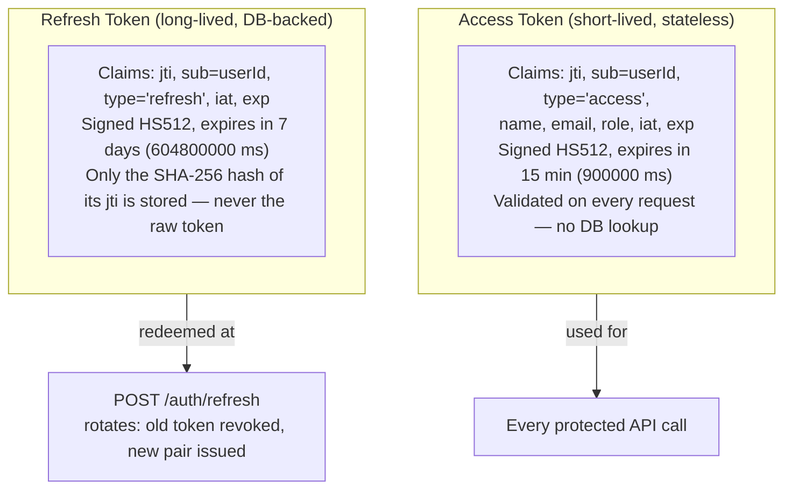
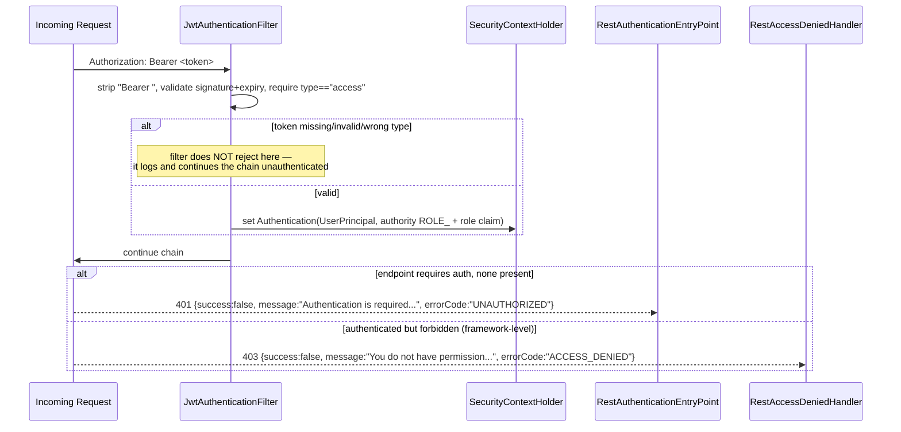

# Security Architecture

## 1. Authentication — JWT

- **Signing**: HMAC-SHA512 (`SignatureAlgorithm.HS512`), key from `jwt.secret` (env `JWT_SECRET`). The base `application.yml` and `application-docker.yml` ship an insecure fallback default (`change-this-default-secret-in-production-...`); `application-prod.yml` has **no default** — a production deploy must supply `JWT_SECRET` explicitly or fail to start correctly signing tokens.
- **Refresh token rotation**: every call to `/auth/refresh` marks the presented token `revoked=true` in MongoDB and issues a brand-new pair — a refresh token can only be used once. Reuse of an already-rotated (or logged-out) token is rejected with 401.
- **Logout**: `POST /auth/logout` revokes the presented refresh token. Since access tokens are stateless, an access token issued before logout remains technically valid until it naturally expires (≤15 minutes) — there is no access-token blocklist.
- **Password storage**: `BCryptPasswordEncoder` (Spring Security default strength).

## 2. Request Authentication Flow

`UserPrincipal` is built **entirely from JWT claims** — no database round-trip on every request. This makes auth checks cheap but means a user's role/email as seen by the API can be stale for up to 15 minutes after being changed in the database (no such "change role" feature currently exists, so this is theoretical today).

## 3. Authorization — Present but Not Enforced

The `Role` enum (`ADMIN`, `ARCHITECT`, `DEVELOPER`) is captured at registration and embedded in every JWT as a single Spring Security authority (`ROLE_<role>`). `SecurityConfig` enables method security (`@EnableMethodSecurity(prePostEnabled = true)`), which is the mechanism `@PreAuthorize` would use.

**However — verified via a repository-wide search — no `@PreAuthorize`, `hasRole(...)`, `hasAuthority(...)`, or `@Secured` annotation exists anywhere in the codebase, and `SecurityConfig`'s URL-based rules never call `.hasRole(...)`.** Every non-public endpoint requires only `.authenticated()`. In the current implementation, **any logged-in user can perform every operation**, regardless of their role. This is a real gap, not a design choice implied by the code elsewhere — documented explicitly so it isn't assumed to work differently.

## 4. Transport & Session

| Concern | Configuration |
|---|---|
| Session management | Fully stateless (`SessionCreationPolicy.STATELESS`) — no server-side session state |
| CSRF | Disabled (`.csrf().disable()`) — appropriate for a stateless, bearer-token JSON API with no cookie-based auth |
| CORS | **Hardcoded** in `SecurityConfig`: origins `http://localhost:3000`, `:5173`, `:9090`; methods `GET,POST,PUT,DELETE,PATCH,OPTIONS`; headers `*`; `allowCredentials: true`; `maxAge: 3600s`. Not environment-driven — a non-localhost production frontend origin requires a code change. |
| Multipart limits | `max-file-size`/`max-request-size` = 1000MB (`application.yml`) |
| Upload safety | `ZipProjectExtractor` guards against zip-slip (path-traversal via crafted archive entries) and enforces `app.project.max-extracted-size-mb` (2000MB default) to bound decompression-bomb risk |

## 5. Public vs. Protected Surface

| Public (no token) | Protected (token required) |
|---|---|
| `POST /auth/register` | `POST /auth/logout`, `GET /auth/me` |
| `POST /auth/login` | Everything under `/projects/**` |
| `POST /auth/refresh` | |
| `GET /health` | |
| `/v3/api-docs/**`, `/swagger-ui/**`, `/swagger-ui.html` | |

## 6. API Documentation Exposure

Swagger UI (`/api/swagger-ui.html`) and the raw OpenAPI spec (`/api/v3/api-docs`) are public in every profile, including `prod`. `OpenApiConfig` registers a global `bearer_jwt` HTTP-bearer security scheme so "Try it out" in Swagger UI can authenticate — but the documentation itself, including every endpoint's shape, is visible to unauthenticated visitors. This is a common and often acceptable trade-off, but worth a deliberate decision before a public production launch.

## 7. Secrets Handling — Historical Finding & Remediation

During this documentation effort, `backend/.env.example` was found to contain **real, working credentials** (a MongoDB Atlas username/password and a working LLM API key) rather than placeholder values, committed across multiple commits and pushed to remote GitHub repositories. This has been corrected — the file now contains only placeholder values — but:

- The original values remain in git history until the repository owner separately rotates the affected credentials and/or rewrites history.
- **Action item for whoever owns this repository**: rotate the MongoDB Atlas password and revoke/reissue the LLM API key referenced in the pre-fix version of `.env.example`, then verify no other committed file (`application-dev.yml`, deployment scripts, etc.) contains real secrets.

This is called out here as a concrete, evidenced example of why `.env.example` files (and any file matching common secret patterns) should be checked before every public push — not a hypothetical "best practice" reminder.

## 8. Summary Checklist

| Control | Status |
|---|---|
| Password hashing | ✅ BCrypt |
| Stateless JWT access tokens | ✅ HS512, 15-min expiry |
| Refresh token rotation & revocation | ✅ DB-backed, single-use |
| CSRF protection | ➖ Disabled (appropriate for this API shape) |
| Role-based authorization | ❌ Not enforced despite `Role` model existing |
| CORS restricted to known origins | ⚠️ Hardcoded to localhost only, not prod-ready |
| Upload path-traversal protection | ✅ Zip-slip guard in `ZipProjectExtractor` |
| Upload size limits | ✅ Multipart + extracted-size caps |
| Secrets externalized via env vars | ✅ in application code, ⚠️ was violated by a committed `.env.example` (now fixed) |
| LLM request timeout | ❌ Not configured |
| API docs restricted in production | ❌ Public in every profile |

---

*Related documents: [06-backend-architecture.md](./06-backend-architecture.md) · [10-api-documentation.md](./10-api-documentation.md) · [15-future-enhancements.md](./15-future-enhancements.md)*
