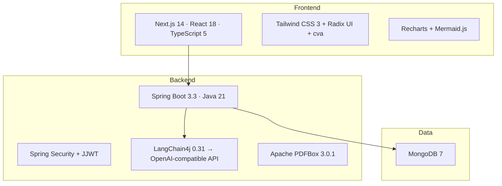

# Technology Stack

Exact versions as declared in `backend/pom.xml` and `frontend/package.json`.

## 1. Backend

| Category | Technology | Version |
|---|---|---|
| Language | Java | 21 |
| Framework | Spring Boot (parent) | 3.3.0 |
| Web | `spring-boot-starter-web` | Spring Boot–managed |
| Security | `spring-boot-starter-security` | Spring Boot–managed |
| Persistence | `spring-boot-starter-data-mongodb` | Spring Boot–managed |
| Validation | `spring-boot-starter-validation` | Spring Boot–managed |
| API docs | `springdoc-openapi-starter-webmvc-ui` | 2.0.4 |
| JWT | `io.jsonwebtoken:jjwt-api` / `jjwt-impl` / `jjwt-jackson` | 0.12.3 |
| AI orchestration | `dev.langchain4j:langchain4j` | 0.31.0 |
| AI provider | `dev.langchain4j:langchain4j-open-ai` | 0.31.0 |
| AI provider (declared, unused) | `dev.langchain4j:langchain4j-azure-open-ai` | 0.31.0 |
| Object mapping (declared, unused) | `org.mapstruct:mapstruct` | 1.6.0 |
| Boilerplate reduction | `org.projectlombok:lombok` | 1.18.30 |
| Utilities | `org.apache.commons:commons-lang3` | Spring Boot–managed |
| Utilities | `commons-io:commons-io` | 2.15.1 |
| JSON | `com.fasterxml.jackson.core:jackson-databind` | Spring Boot–managed |
| PDF generation | `org.apache.pdfbox:pdfbox` | 3.0.1 |
| Build | Maven | — |
| Test | `spring-boot-starter-test`, `spring-security-test` | Spring Boot–managed |
| Test | `de.flapdoodle.embed:de.flapdoodle.embed.mongo.spring30x` | 4.11.0 |

## 2. Frontend

### Dependencies

| Category | Package | Version |
|---|---|---|
| Framework | `next` | ^14.1.0 |
| UI library | `react` / `react-dom` | ^18.2.0 |
| Language | `typescript` | ^5.3.3 |
| Styling | `tailwindcss` | ^3.4.1 (devDependency) |
| Component variants | `class-variance-authority` | ^0.7.0 |
| Class merging | `clsx` / `tailwind-merge` | ^2.0.0 / ^2.2.1 |
| Headless UI primitives | `@radix-ui/react-alert-dialog`, `-dialog`, `-dropdown-menu`, `-navigation-menu`, `-separator`, `-slot`, `-tabs` | ^1.0.x–^2.0.6 |
| HTTP client | `axios` | ^1.6.2 |
| Forms | `react-hook-form` | ^7.48.0 |
| Schema validation | `zod` | ^3.22.4 |
| Form/validation glue | `@hookform/resolvers` | ^3.3.4 |
| Icons | `lucide-react` | ^0.292.0 |
| Charts | `recharts` | ^2.10.3 |
| Diagrams | `mermaid` | ^10.9.6 |
| Flow diagrams | `react-flow-renderer` | ^10.3.17 |
| Toasts | `sonner` | ^2.0.7 |
| Client-side PDF | `@react-pdf/renderer` | ^3.4.5 |
| Dates | `date-fns` | ^2.30.0 |
| Cookies | `js-cookie` | ^3.0.5 |
| State (declared, unused) | `zustand` | ^4.4.1 |
| URL state | `use-query-params` | ^2.2.1 |

### Dev Dependencies

| Package | Version |
|---|---|
| `eslint` / `eslint-config-next` | ^8.56.0 / ^14.1.0 |
| `@typescript-eslint/eslint-plugin` / `parser` | ^6.15.0 |
| `prettier` | ^3.1.0 |
| `jest` / `jest-environment-jsdom` | ^29.7.0 |
| `@testing-library/react` / `jest-dom` | ^14.1.2 / ^6.1.5 |
| `postcss` / `autoprefixer` | ^8.4.32 / ^10.4.17 |
| `@types/*` | node, react, react-dom, js-cookie |

**Runtime requirements** (`package.json` `engines`): Node.js ≥18, npm ≥9.

## 3. Data Store

| Component | Version |
|---|---|
| MongoDB | 7 (`mongo:7` image in `docker-compose.yml`) |
| Connection | Spring Data MongoDB, Atlas SRV URI in `dev`/`prod`, plain host:port in `docker` profile |

## 4. AI / LLM

| Component | Detail |
|---|---|
| Orchestration library | LangChain4j 0.31.0 |
| Active provider | OpenAI-compatible Chat Completions API (`OpenAiChatModel`) — configurable base URL, so any OpenAI-API-compatible proxy/provider works |
| Model (default) | `gpt-4` (overridable via `OPENAI_MODEL`/`LLM_MODEL`) |
| Declared but unused | Azure OpenAI (`langchain4j-azure-open-ai`), OpenAI embeddings (`text-embedding-3-small`) |

## 5. Containerization

| Component | Base image |
|---|---|
| Backend build stage | `maven:3.9-eclipse-temurin-21` |
| Backend runtime | `eclipse-temurin:21-jre-alpine` |
| Frontend build/runtime | `node:20-alpine` |
| Database | `mongo:7` |

## 6. Stack Summary Diagram

---

*Related documents: [06-backend-architecture.md](./06-backend-architecture.md) · [07-frontend-architecture.md](./07-frontend-architecture.md) · [12-deployment-architecture.md](./12-deployment-architecture.md)*
