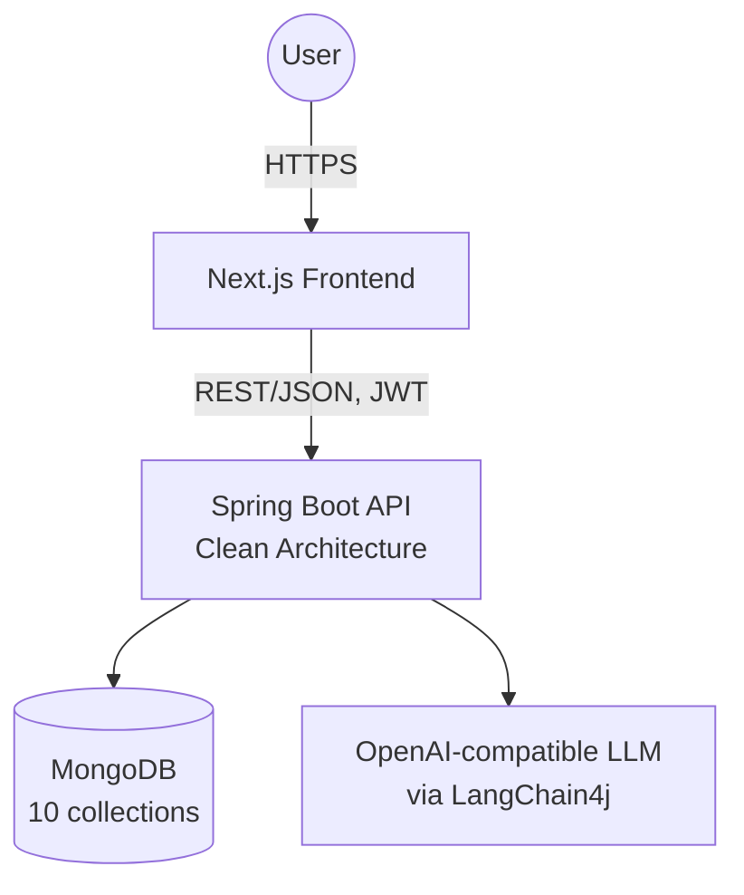

# AI Legacy Modernization Copilot — Documentation

An AI-powered platform for analyzing, assessing, and modernizing enterprise legacy applications. Upload a legacy Java codebase (Servlets, JSP, Struts, EJB, JDBC, COBOL/JCL, and more), and the system runs a mix of deterministic technology detection and LLM-driven analysis — business logic, architecture, security, performance — culminating in a prioritized modernization roadmap, sample Spring Boot code, and a downloadable report.

This documentation set was generated directly from the project's source code (`backend/` and `frontend/`), verified against the actual implementation rather than the project's own design aspirations where the two differ. Every claim is traceable to a real file in this repository.

## Contents

| # | Document | Covers |
|---|---|---|
| 01 | [System Architecture](./01-system-architecture.md) | Container/deployment view, request flow, Clean Architecture layering, cross-cutting concerns |
| 02 | [High-Level Design](./02-high-level-design.md) | Actors, functional capability map, core design decisions and their trade-offs |
| 03 | [Low-Level Design](./03-low-level-design.md) | Domain entity class diagram, enums, exceptions, full use-case catalog |
| 04 | [Folder Structure](./04-folder-structure.md) | Verified repository tree, backend and frontend |
| 05 | [Module Overview](./05-module-overview.md) | Per-module responsibility summary, backend and frontend |
| 06 | [Backend Architecture](./06-backend-architecture.md) | Layered architecture verified against `backend/ARCHITECTURE.md`, config surface, build |
| 07 | [Frontend Architecture](./07-frontend-architecture.md) | Route map, rendering model, state management, design system |
| 08 | [Database Design](./08-database-design.md) | 10 MongoDB collections, ER diagram, document shape |
| 09 | [AI Agent Design](./09-ai-agent-design.md) | The deterministic detection engine *and* the six LLM-driven agents, prompt design, context enrichment |
| 10 | [API Documentation](./10-api-documentation.md) | Every REST endpoint, request/response shapes, validation, error codes |
| 11 | [Sequence Diagrams](./11-sequence-diagrams.md) | Auth, upload, AI analysis, modernization plan, and report generation flows |
| 12 | [Deployment Architecture](./12-deployment-architecture.md) | Docker/`docker-compose.yml`, Spring profiles, observability |
| 13 | [Security Architecture](./13-security-architecture.md) | JWT design, authorization status, CORS, a real secrets-handling finding and its fix |
| 14 | [Technology Stack](./14-technology-stack.md) | Exact dependency versions, backend and frontend |
| 15 | [Future Enhancements](./15-future-enhancements.md) | Evidence-based roadmap: unfinished scaffolding, identified gaps |

Also in this folder: **`Modernization-architecture.png`** — a rendered system architecture diagram.

## How to Read This Documentation Honestly

Two principles were followed throughout:

1. **Only what's actually in the code.** Where `backend/ARCHITECTURE.md` describes an intended structure that doesn't match reality — e.g. `application/orchestrators/` and `domain/services/` are empty marker interfaces with no real implementation, `application/dto/` is an empty directory, MapStruct is a declared-but-unused dependency — this documentation says so explicitly rather than presenting the aspiration as fact.
2. **Gaps are documented, not hidden.** For example: the `Role`-based authorization model exists end-to-end (enum, JWT claim, Spring Security authority) but is not enforced on any endpoint today; no request timeout is configured for LLM calls; CORS origins are hardcoded to `localhost`. These are called out in [13-security-architecture.md](./13-security-architecture.md) and [15-future-enhancements.md](./15-future-enhancements.md) precisely so nobody building on this system assumes otherwise.

## Quick Facts

| | |
|---|---|
| Backend | Java 21, Spring Boot 3.3.0, Clean Architecture (domain / application / interfaces / infrastructure) |
| Frontend | Next.js 14 (App Router), React 18, TypeScript, Tailwind CSS |
| Database | MongoDB 7, 10 collections |
| AI | LangChain4j 0.31.0 → OpenAI-compatible Chat Completions API, 6 LLM agents + 1 fully deterministic rule-based engine |
| Auth | Stateless JWT (HS512), 15-min access / 7-day rotating refresh tokens |
| API surface | 11 REST controllers, ~22 endpoints, all under `/api` |
| Reporting | Server-side PDFBox-generated report + an independent client-side `@react-pdf/renderer` export |

## System Architecture at a Glance

See [01-system-architecture.md](./01-system-architecture.md) for the full diagram set.

---

*Generated as a comprehensive, code-verified documentation pass. Application source code was not modified in the process of producing this documentation (one exception: `backend/.env.example` was corrected to remove real credentials that had been committed in place of placeholders — see [13-security-architecture.md](./13-security-architecture.md) §7 for detail).*
